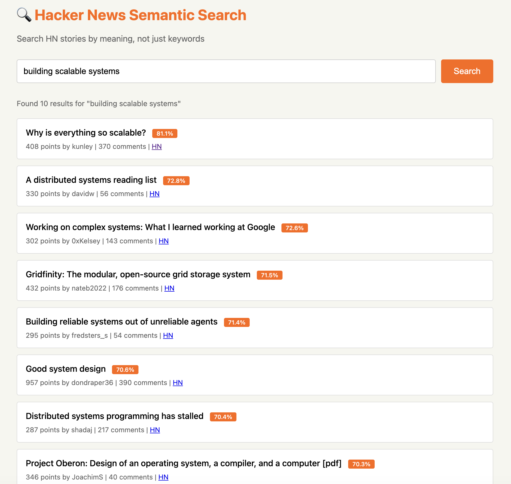

# Hacker News Semantic Search

A semantic search engine for Hacker News posts using sentence embeddings and vector similarity search. Search by meaning, not just keywords.



## Features

- **Semantic Search**: Find relevant HN posts based on meaning, not just keyword matching
- **Vector Database**: Uses OpenSearch for efficient similarity search
- **Fast Embeddings**: all-MiniLM-L6-v2 model for quick, high-quality embeddings
- **Web Interface**: Simple, clean UI for searching
- **REST API**: FastAPI backend for programmatic access
- **Large Dataset**: Access to complete HN archive (11.9GB, 47M+ items)

## Architecture

- **Data Source**: Hugging Face dataset `open-index/hacker-news` (live-updated every 5 minutes)
- **Embeddings**: Sentence-transformers (all-MiniLM-L6-v2)
- **Vector DB**: OpenSearch with k-NN HNSW index and cosine similarity
- **API**: FastAPI with async support
- **Query**: DuckDB for efficient Parquet reading from HuggingFace

## Prerequisites

- Python 3.8+
- OpenSearch running locally on port 9200

### Start OpenSearch

Using Docker:
```bash
docker run -d -p 9200:9200 -p 9600:9600 \
  -e "discovery.type=single-node" \
  -e "OPENSEARCH_JAVA_OPTS=-Xms512m -Xmx512m" \
  opensearchproject/opensearch:latest
```

Or install OpenSearch directly from [opensearch.org](https://opensearch.org/downloads.html)

## Installation

```bash
# Create a virtual environment
python3 -m venv venv
source venv/bin/activate  # On Windows: venv\Scripts\activate

# Install dependencies
pip install -r requirements.txt
```

## Usage

### 1. Build the Search Index

First, load and index Hacker News stories:

```bash
python build_index.py
```

Options:
- `--limit 10000`: Maximum number of stories to index (default: 10000)
- `--min-score 10`: Minimum score threshold (default: 10)
- `--years 2023 2024 2025`: Years to load (default: 2023-2026)
- `--clear`: Clear existing index before building

Examples:
```bash
# Index top 5000 stories from 2024-2025
python build_index.py --limit 5000 --years 2024 2025

# Index highly-rated stories (score >= 50)
python build_index.py --limit 20000 --min-score 50

# Start fresh with new data
python build_index.py --clear --limit 10000
```

**Note**: First run will download the embedding model (~90MB) and may take a few minutes to generate embeddings.

### 2. Start the Search API

Launch the web server:

```bash
python search_api.py
```

The server will start at `http://localhost:8000`

### 3. Search!

**Web Interface**: Open http://localhost:8000 in your browser

**API Endpoint**: 
```bash
curl "http://localhost:8000/search?q=machine%20learning&n=5"
```

**Example Queries**:
- "building distributed systems"
- "startup funding advice"
- "programming language design"
- "climate change solutions"
- "privacy and security"

## API Reference

### `GET /search`

Search for stories semantically similar to a query.

**Parameters**:
- `q` (required): Search query string
- `n` (optional): Number of results (1-50, default: 10)

**Response**:
```json
{
  "query": "machine learning",
  "results": [
    {
      "id": "12345",
      "title": "GPT-4 Technical Report",
      "url": "https://example.com/paper.pdf",
      "score": 842,
      "author": "username",
      "time": "2024-03-14 10:30:00",
      "comments": 234,
      "similarity": 0.85
    }
  ],
  "total_results": 10
}
```

### `GET /stats`

Get index statistics.

**Response**:
```json
{
  "total_stories": 10000,
  "model": "all-MiniLM-L6-v2"
}
```

## How It Works

1. **Data Loading**: DuckDB queries the Hacker News Parquet files directly from HuggingFace without downloading
2. **Content Preparation**: Combines title, URL, and text into searchable content
3. **Embedding Generation**: Sentence transformer converts text to 384-dimensional vectors
4. **Indexing**: OpenSearch stores vectors with k-NN HNSW index for fast similarity search
5. **Search**: Query is embedded and matched against stored vectors using cosine similarity

## Dataset Info

- **Source**: [open-index/hacker-news](https://huggingface.co/datasets/open-index/hacker-news)
- **Size**: 11.9 GB (47,991,591 items)
- **Updates**: Every 5 minutes
- **License**: ODC-By v1.0
- **Content**: Stories, comments, jobs, polls from Oct 2006 - present

## Performance

- **Indexing**: ~5-10 minutes for 10,000 stories (one-time operation)
- **Search**: <100ms for typical queries
- **Memory**: ~2-3GB RAM for 10,000 stories
- **Storage**: ~500MB for index and embeddings

## Customization

### Use a Different Embedding Model

Edit `config.py`:
```python
EMBEDDING_MODEL = "all-mpnet-base-v2"  # More accurate but slower
```

Popular alternatives:
- `all-mpnet-base-v2`: Higher quality (768-dim)
- `paraphrase-MiniLM-L6-v2`: Optimized for paraphrase detection
- `multi-qa-MiniLM-L6-cos-v1`: Optimized for Q&A

### Load More Data

```bash
# Index 50K stories from all years
python build_index.py --limit 50000 --years 2020 2021 2022 2023 2024 2025 2026
```

### Change the UI

Edit the HTML in `search_api.py` (FastAPI root endpoint) to customize the interface.

## Troubleshooting

**Index is empty error**: Run `python build_index.py` first

**Out of memory**: Reduce `--limit` or use a smaller embedding model

**Slow searches**: The first query after startup may be slow while models load into memory

**Connection errors**: Check that port 8000 is available

## Future Enhancements

- [ ] Filter by date range, score, author
- [ ] Hybrid search (semantic + keyword)
- [ ] Search comments in addition to stories
- [ ] Related stories recommendation
- [ ] Export search results
- [ ] Batch search API
- [ ] Docker deployment

## License

MIT License - feel free to use and modify!

## Credits

- Dataset: [open-index/hacker-news](https://huggingface.co/datasets/open-index/hacker-news)
- Embeddings: [Sentence Transformers](https://www.sbert.net/)
- Vector DB: [OpenSearch](https://opensearch.org/)
